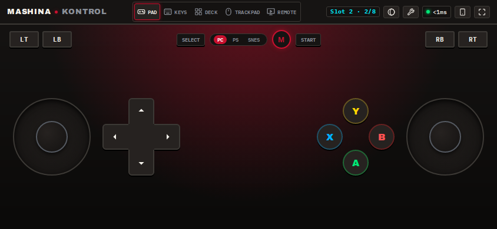
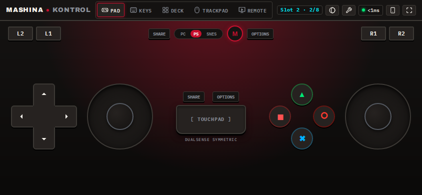
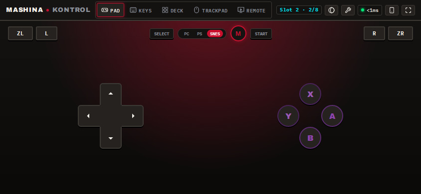
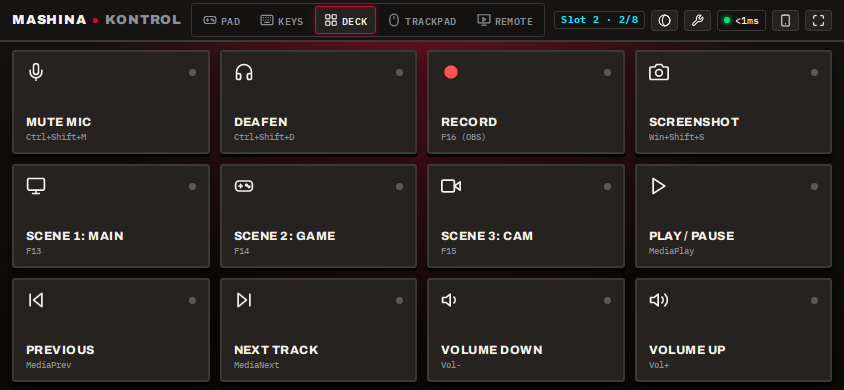
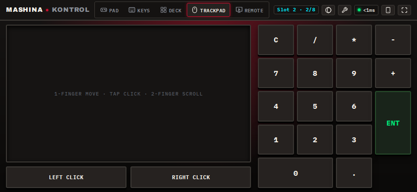
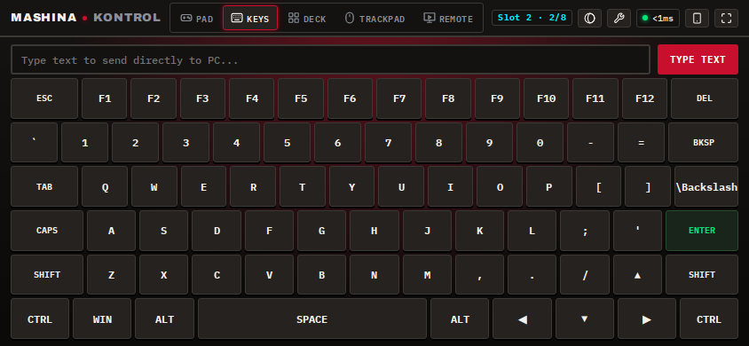
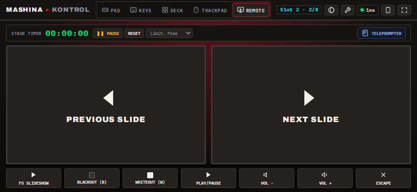
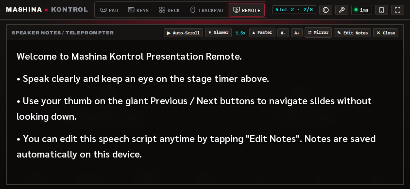
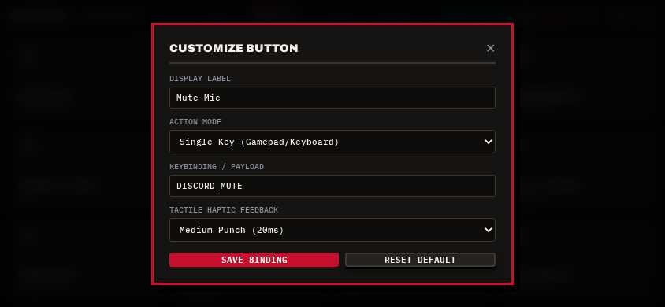
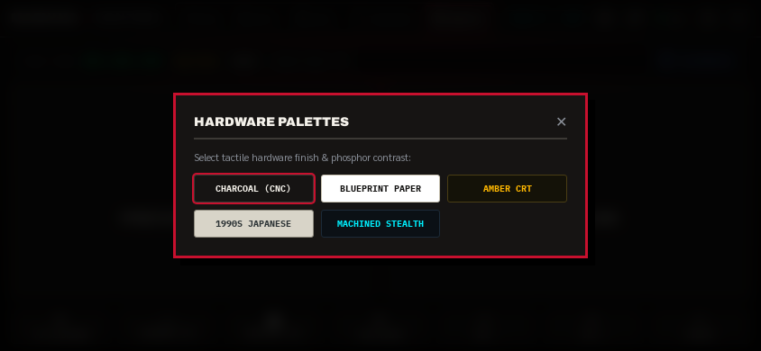

<div align="center">

# 🎮 MASHINA KONTROL
### Ultra-Low Latency Virtual PC Game Controller, Stream Deck & Precision Trackpad

*Turn any smartphone into a physical PC game controller with sub-millisecond response, zero mobile app installation, and zero cloud relays.*

[](https://github.com/Bexx1107/mashina-kontrol/releases/latest)
[](LICENSE)
[](#-architecture--latency)
[-FFB800.svg?style=for-the-badge)](#-native-gamepad-engine)
[](#-quick-start)
[](#-zero-install-mobile-experience)

<br/>

[**⬇️ Download Windows Installer (Setup)**](https://github.com/Bexx1107/mashina-kontrol/releases/latest/download/Mashina-Kontrol-Setup-2.1.0.exe) &nbsp;&bull;&nbsp; [**⚡ Download Portable (.exe)**](https://github.com/Bexx1107/mashina-kontrol/releases/latest/download/Mashina-Kontrol-Portable-2.1.0.exe) &nbsp;&bull;&nbsp; [**📖 Documentation**](#-the-6-modular-decks)

<br/>

---

### 🕹️ Authentic Gamepad Layouts (Xbox Standard · PlayStation DualSense · SNES Retro)
<p align="center">
  
  
  
</p>

### 🎛️ 12-Tile Macro Deck & 🖱️ Inertial Glass Trackpad with 10-Key Numpad
<p align="center">
  
  
</p>

### ⌨️ Full QWERTY Keyboard & 📽️ Stage Presentation Remote with Teleprompter
<p align="center">
  
  
  
</p>

### ⚙️ In-App Button Customizer & 🎨 Industrial Hardware Themes
<p align="center">
  
  
</p>

---

</div>

## ⚡ Highlights

* **🎮 Genuine Windows XInput Gamepad**: Driven by the native **ViGEmBus** kernel driver. Windows and games (*Overcooked!*, *Rocket League*, *Elden Ring*, *Steam Big Picture*, *RetroArch*, *Forza*) recognize your phone as a **real physical Xbox 360 controller**.
* **⚡ Sub-Millisecond Input Latency (<0.1ms)**: Packaged RFC 6455 binary WebSockets stream inputs directly from your touch digitizer into the Windows OS input dispatch queue.
* **📱 Zero Mobile Installation**: No App Store downloads, no signed certificates, and no sideloading. Simply scan the desktop QR code to open the ultra-smooth Progressive Web App (PWA).
* **🖐️ 100% Freely Movable & Scalable**: In Edit Mode (wrench ⚙️), every single module—D-pad, face diamond, thumbsticks, and **L1/L2 and R1/R2 shoulder clusters**—can be dragged anywhere and scaled between 50% and 200%.
* **🔒 100% Private & Local**: Zero cloud relays, zero accounts, zero analytics. Pair securely over your local Wi-Fi with an automatic 4-digit PIN.
* **👥 8-Player Couch Co-Op**: Connect up to 8 smartphones simultaneously for local multiplayer party gaming.

---

## 🛠️ The 6 Modular Decks

| Deck | Description | Key Features |
|---|---|---|
| **1. 🎮 Virtual Gamepad** | Complete replacement for physical controllers | Xbox Asymmetrical, PS Symmetrical & SNES Retro layouts. Dual dynamic thumbsticks, haptic triggers, L1/L2 & R1/R2 shoulder buttons. |
| **2. 🎛️ Stream Deck** | 12 tactile broadcast macro tiles | Discord Mute/Deafen, OBS Studio scene switching (`F13`–`F15`), clip recording (`F16`), screenshot (`Win+Shift+S`), and media transport. |
| **3. 🖱️ Glass Trackpad** | Precision laptop-grade touchpad + numpad | Momentum physics, 1-finger glide, 2-finger scroll/right-click, mechanical click rockers, and full 10-key numeric keypad. |
| **4. ⌨️ Full Keyboard** | Wireless desktop QWERTY input | Latched modifiers (`Ctrl`, `Alt`, `Shift`, `Win`), arrow keys, function keys, and instantaneous single-tap text beams. |
| **5. 📽️ Presentation Remote** | Stage clicker & teleprompter | Oversized slide controls (`F5`, `Next`, `Prev`), audience blackout (`B`) and whiteout (`W`) switches, and live elapsed timer. |
| **6. 🖥️ Command Hub** | Desktop monitor & system tray host | Live mechanical wireframe visualizer, QR pairing code, PIN editor, and multiplayer lobby slot manager. |

---

## 🚀 Quick Start

### For Gamers (Pre-Built Installer)
1. Download **[Mashina-Kontrol-Setup-2.1.0.exe](https://github.com/Bexx1107/mashina-kontrol/releases/latest/download/Mashina-Kontrol-Setup-2.1.0.exe)**.
2. Run the installer (includes ViGEmBus virtual controller driver).
3. Launch **Mashina Kontrol** from your desktop or start menu.
4. Scan the QR code with your phone camera or type the local IP into your phone's browser (e.g., `http://192.168.1.50:3480`).
5. Pick up your phone and play!

---

### 💻 Run From Source (Developers)

```bash
# 1. Clone the repository
git clone https://github.com/Bexx1107/mashina-kontrol.git
cd mashina-kontrol

# 2. Install dependencies
npm install

# 3. Launch the desktop Electron application
npm run electron

# Or run headless daemon (pure Node.js)
npm start
```

---

## 📦 Building & Packaging

Mashina Kontrol packages into standalone desktop installers using Electron & `electron-builder`:

```bash
# Build Windows Installer (.exe) & Portable executable
npm run build:win

# Build macOS Disk Image (.dmg) & .zip
npm run build:mac
```
Output binaries are generated in the `dist/` directory.

---

## 🔬 Architecture & Latency

```
┌─────────────────────────────────────────────────────────┐
│              SMARTPHONE / TABLET BROWSER                │
│    Gamepad · Stream Deck · Trackpad · Keys · Remote     │
│   Haptic Vibrations · Spring Thumbsticks · Multi-Touch  │
└────────────────────────────┬────────────────────────────┘
                             │
                             │ Packed RFC 6455 Binary WebSockets
                             │ Sub-0.1ms Processing · 100% Local LAN
                             ▼
┌─────────────────────────────────────────────────────────┐
│        MASHINA KONTROL ELECTRON DESKTOP DAEMON          │
│       System Tray Host · Local IP Discovery · Port 3480 │
└──────────────┬───────────────────────────┬──────────────┘
               │                           │
               ▼                           ▼
┌───────────────────────────────┐ ┌───────────────────────┐
│   Nefarius ViGEmBus Engine    │ │ Win32 SendInput Bridge│
│  Virtual Xbox 360 Controller  │ │ Scan-Code Injection   │
│  Steam, Overcooked, Emulators │ │ OBS, Discord, Desktop │
└───────────────────────────────┘ └───────────────────────┘
```

---

## 🎨 Switchable Hardware Themes

Mashina Kontrol includes 5 built-in machined themes tailored for OLED battery savings and tactile contrast:

* **Cyber Dark** (Default) — Carbon black with high-contrast signal crimson & amber accents.
* **Pure Amber** — Monochromatic amber glow reminiscent of classic Braun & retro computing gear.
* **Matrix Terminal** — CRT phosphor green aesthetic with deep terminal blacks.
* **DualSense Titanium** — Crisp slate and frosted accents inspired by modern console hardware.
* **Paper Minimal** — Ultra-clean daylight theme with crisp typographic hierarchy.

---

## 📜 License

Distributed under the **MIT License**. See [`LICENSE`](LICENSE) for more information.

Part of **Mashina Studio** · [https://mashina-studio.eu](https://mashina-studio.eu)  
Crafted with precision by **Žan Zupančič / Bexx**.
